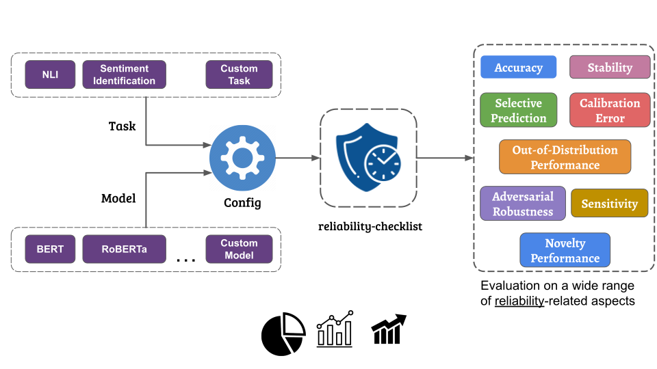
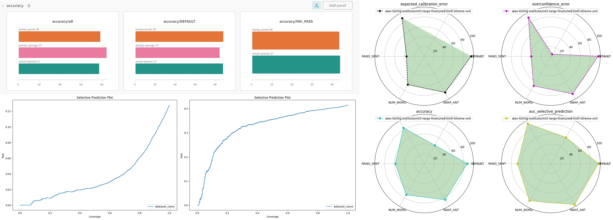

<div align="center">


<p align="center">
  <a href="https://reliability-checklist.readthedocs.io/en/readthedocs/">[documentation]</a>
  <br> <br>
</p>

<a href="https://pytorch.org/get-started/locally/"></a>
<a href="https://pytorchlightning.ai/"></a>
<a href="https://hydra.cc/"></a>
<a href="https://github.com/ashleve/lightning-hydra-template"></a><br>

</div>

# Description

`reliability-checklist` is a Python framework (available via `CLI`) for Comprehensively Evaluating the Reliability of NLP Systems

> `reliability-checklist` accepts any model and dataset as input and facilitates the comprehensive evaluation on a wide range of reliability-related aspects such as accuracy, selective prediction, novelty detection, stability, sensitivity, and calibration.

## **Why you might want to use it:**

<b>✅ No coding needed</b><br>
Pre-defined templates available to easily integrate your models/datasets via command line only.

<b>✅ Bring Your own Model (BYoM)</b><br>
Your model template is missing? We have you covered: Check out [BYoM](<>) to create your own model specific config file.

<b>✅ Bring Your own Data (BYoD)</b><br>
Your dataset template is missing? Check out [BYoD](<>) to create your own dataset specific config file.

<b>✅ Reliability metrics</b><br>
Currently, we support a number of reliability related aspects:

- <b>Accuracy/F1/Precision/Recall</b>
- <b>Calibration:</b> Reliability Diagram Expected Calibration Error (ECE), Expected Overconfidence Error (EOE)
- <b>Selective Prediction:</b> Risk-Coverage Curve (RCC), AUC of risk-coverage curve
- <b>Sensitivity</b>
- <b>Stability</b>
- <b>Out-of-Distribution</b>

## **Upcoming Reliability Aspects:**

- <b>Adversarial Attack:</b> Model in the loop adversarial attacks to evaluate model's robustness.
- <b>Task-Specific Augmentations:</b> Task-specific augmentations to check the reliability on augmented inputs.
- <b>Novelty</b>
- <b>Other Measures:</b> We plan to incorporate other measures such as bias, fairness, toxicity, and faithfulness of models. We also plan to measure the reliability of generative models on crucial parameters such as hallucinations.

## Workflow

<b>✅ Want to integrate more features?</b><br>
Our easy-to-develop infrastructure allows developers to contribute models, datasets, augmentations, and evaluation metrics seamlessly to the workflow.



# How to install?

```bash
pip install git+https://github.com/Maitreyapatel/reliability-checklist

python -m spacy download en_core_web_sm
python -c "import nltk;nltk.download('wordnet')"
```

# How to use?

Evaluate example model/data with default configuration

```bash
# eval on CPU
recheck

# eval on GPU
recheck trainer=gpu +trainer.gpus=[1,2,3]
```

Evaluate model with chosen dataset-specific experiment configuration from [reliability_checklist/configs/task/](reliability_checklist/configs/task/)

```bash
recheck tasl=<task_name>
```

Specify the custom model_name as shown in following MNLI example

```bash
# if model_name is used for tokenizer as well.
recheck task=mnli custom_model="bert-base-uncased-mnli"

# if model_name is different for tokenizer then
recheck task=mnli custom_model="bert-base-uncased-mnli" custom_model.tokenizer.model_name="ishan/bert-base-uncased-mnli"
```

## Add custom_model config

```bash
# create config folder structure similar to reliability_checklist/configs/
mkdir ./configs/
mkdir ./configs/custom_model/

# run following command after creating new config file inside ./configs/custom_model/<your-config>.yaml
recheck task=mnli custom_model=<your-config>
```

# Visualization of results

`reliability-checklist` supports the wide range of visualization tools. One can decide to go with default wandb online visualizer. It also generates plots that are highly informative which will be stored into `logs` directory.



# 🤝 Contributing to `reliability-checklist`

Any kind of positive contribution is welcome! Please help us to grow by contributing to the project.

If you wish to contribute, you can work on any features/issues [listed here](https://github.com/Maitreyapatel/reliability-checklist/issues) or create one on your own. After adding your code, please send us a Pull Request.

> Please read [`CONTRIBUTING`](CONTRIBUTING.md) for details on our [`CODE OF CONDUCT`](CODE_OF_CONDUCT.md), and the process for submitting pull requests to us.

______________________________________________________________________

<h1 align="center">
A ⭐️ to <b>reliability-checklist</b> is to build the reliability of Language Models.
</h1>
